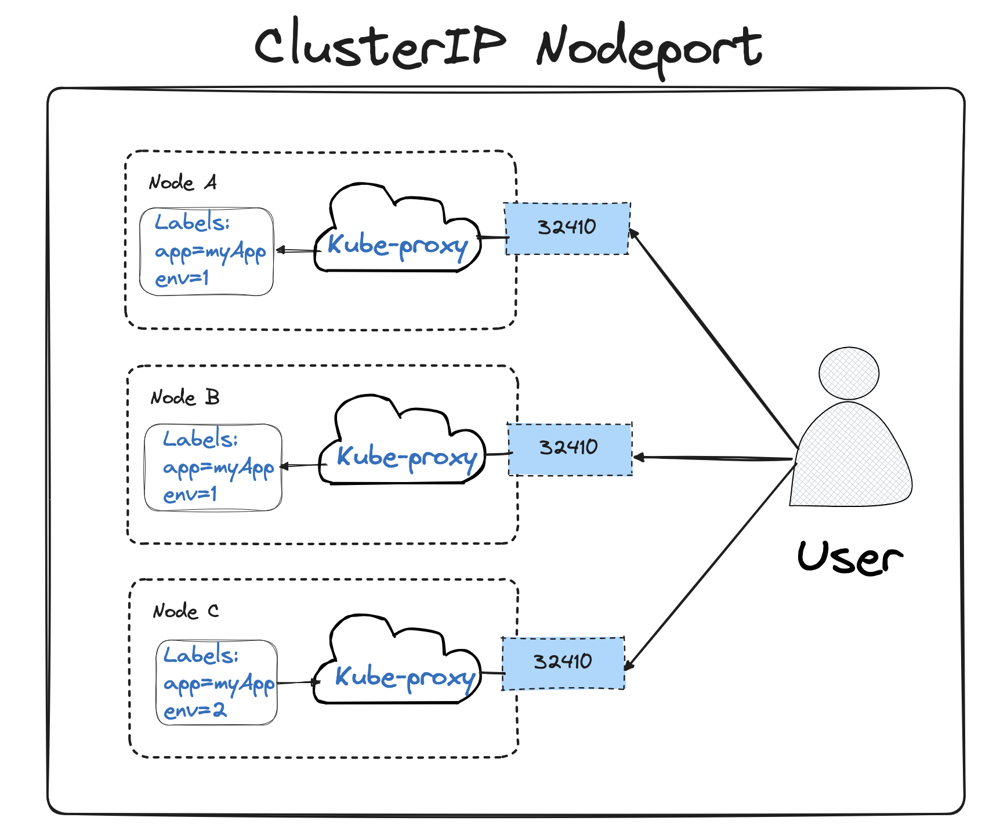
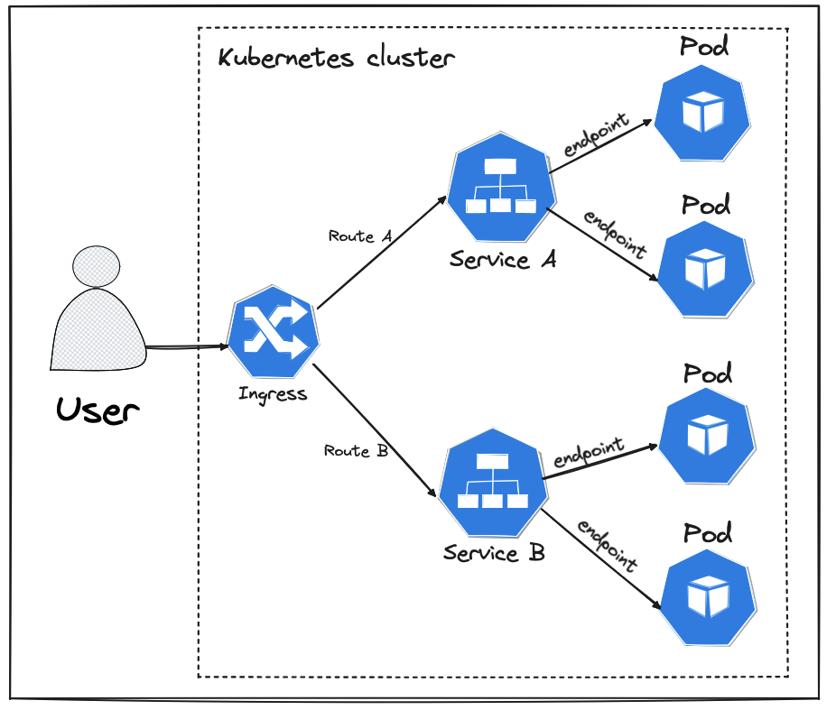

# Chapter-IV-Exposing-Pods

# Servicios


un servicio se describe como una forma abstarcta de exponer una aplicación ejecutándose en un Pod. Es decir, es una capa de indirección entre un Pod y otra entidad.

- **K8s tiene dos redes: Una para los Pods y otra para los servicios.**
- Ips del los servicios no contest a `ping` => No enruta => Son Ips virtuales (privadas).
- IPs de los servicios **NO cambia una vez creada**
- IP de Pod es efimeras.  
- Los servicios **TIENEN UNA VIDA MÁS LARGA que un Pod**.
- Un servicio ==> Actúa como un Loadbalancer

=> Los endpoints no son más que un **recurso de K8s que contiene uno o más direcciones IPs y puertos**.

Cuando creas un servicio en Kubernetes, el servicio utiliza un selector para identificar los pods que deberían recibir el tráfico. Kubernetes automáticamente crea y gestiona un objeto de tipo Endpoints que contiene la lista de IPs y puertos de los pods seleccionados.

Estos endpoints son utilizados internamente por Kubernetes para enrutar el tráfico desde el servicio a los pods correspondientes. Esto permite la abstracción y hace que los pods puedan ser reemplazados, actualizados o escalados sin que los consumidores del servicio necesiten conocer los detalles específicos de los pods.

`Los clientes que utilizan el servicio solo necesitan conocer el nombre del servicio y su puerto`, **no las direcciones IP específicas de los pods** que están detrás del servicio. Kubernetes gestiona dinámicamente la relación entre el servicio y los pods, actualizando los endpoints conforme los pods cambian, sin que esto sea visible o relevante para los consumidores del servicio.

## ClusterIp

                          +--------------------+
                          -     ClusterIP      - 
                          +--------------------+


ClusterIP expone el servicio de forma interna, es decir, **solo es accesible desde dentro del clúster**.

`Ventajas o diferenica es que los servicios son permanentes y sus IPs no cambian`

```bash
kubectl run myapp --image tuxotron/demoapp:v1 --labels app=myapp,ver=1
```

**Ver los labels de un Pod:**
```bash
kubectl get pods --show-labels
````


**Ver los servicios:**
```bash
kubectl get services
````


```bash
youneskabiri@Youness-MacBook-Pro Chapter-IV-Exposing-Pods % kubectl get pods --show-labels
NAME                                READY   STATUS             RESTARTS        AGE   LABELS
myapp                               0/1     CrashLoopBackOff   8 (3m45s ago)   19m   app=myapp,ver=1
```

Este comando crear un Pod con la imagen `tuxotron/demoapp:v1`y con dos labels `app=myapp,ver=1`.

```yaml
apiVersion: v1
kind: Service
metadata:
  name: my-service
spec:
  type: ClusterIP
  selector:
    app: myapp
    ver: "1"
  ports:
    - port: 80
      targetPort: 8080
```

K8s al recibir la petición, el controlador de servicios buscará el espacio de nombres donde se despliegue el servicio los Pods que contengan esas dos etiquetas (app=myapp,ver=1). Y por cada Pod que encuentra crea un `endpoint` con IP del Pod y el puerto especifico en `targetPort`, y lo añade al servicio.  Y por último, define el puerto (80) que recibe las peticiones.

```bash
kubectl apply -f files/service-clusterIP.yaml 
```

```bash
kubectl describe service my-service
```

***Ver los endpoints :***
```bash
kubectl get endpoints
kubectl describe endpoints my-service
***

youneskabiri@Youness-MacBook-Pro Chapter-IV-Exposing-Pods % kubectl apply -f files/service-clusterIP.yaml 
    service/my-service created
youneskabiri@Youness-MacBook-Pro Chapter-IV-Exposing-Pods % kubectl describe service my-service
    Name:              my-service
    Namespace:         default
    Labels:            <none>
    Annotations:       <none>
    Selector:          app=myapp,ver=1
    Type:              ClusterIP
    IP Family Policy:  SingleStack
    IP Families:       IPv4
    IP:                10.110.128.211
    IPs:               10.110.128.211
    Port:              <unset>  80/TCP
    TargetPort:        8080/TCP
    Endpoints:         
    Session Affinity:  None
    Events:            <none>
```

**Al crear diferentes Pods con las misma labels, se añaden automaticamnete al mismo servicio que hará de LoadBalancer.**

## NodePort

                          +--------------------+
                          -     NodePort       - 
                          +--------------------+
                          +--------------------+
                          -     ClusterIP      - 
                          +--------------------+



NodePort expone en un puerto estático de cada nodo del clúster. Este es una extensión del tipo ClusterIP, es decir, `es un servicio tipo ClusterIP con el mapeo del puerto del servicio a un puerto estático en todos los nodos del clúster`

**Lo interesante, es que se puede hacer una petición a cualquier de los nodos en el clúster, sin importar si el Pod al que apunta se encuentra ejecutándose en el dicho nodo.**

Para ver un ejemplo, debemos crear un clúster con `minikube con multiples nodos`:
```bash
minikube delete
minikube start --driver=vmware --cni=cilium --memory=4gb --nodes=2
```

**Si estamos en macOs:**
```bsh
minikube start --cni=cilium --memory=4gb --nodes=2
```

**Con `--cni=cilium` añadimos un Container Network Interface** para poder comunicar diferentes nodos.

**Ver los nodos del clúster:**
```bash
kubectl get nodes -o wide
```

```bash
kubectl run myapp-np --image nginx:latest --labels app=myapp,ver=nodeport
```
Ahora vamos a crear un servicio `nodeport-servie`

```bash
kubectl apply -f files/service-nodePort.yaml
kubectl describe nodeport-service
```
```bash
youneskabiri@Youness-MacBook-Pro Chapter-IV-Exposing-Pods % kubectl apply -f files/ service-nodePort.yaml

  service/nodeport-service created

youneskabiri@Youness-MacBook-Pro Chapter-IV-Exposing-Pods % kubectl get services             
  NAME               TYPE        CLUSTER-IP      EXTERNAL-IP   PORT(S)        AGE
  kubernetes         ClusterIP   10.96.0.1       <none>        443/TCP        14m
  nodeport-service   NodePort    10.101.73.255   <none>        80:30852/TCP   20s

youneskabiri@Youness-MacBook-Pro Chapter-IV-Exposing-Pods % kubectl describe service nodeport-service
  Name:                     nodeport-service
  Namespace:                default
  Labels:                   <none>
  Annotations:              <none>
  Selector:                 app=myapp,ver=nodeport
  Type:                     NodePort
  IP Family Policy:         SingleStack
  IP Families:              IPv4
  IP:                       10.101.73.255
  IPs:                      10.101.73.255
  Port:                     <unset>  80/TCP
  TargetPort:               8080/TCP
  NodePort:                 <unset>  30852/TCP<--------
  Endpoints:                10.244.1.98:8080<-----------
  Session Affinity:         None
  External Traffic Policy:  Cluster
  Events:                   <none>
```
```bash
youneskabiri@Youness-MacBook-Pro ~ % kubectl get nodes
  NAME           STATUS   ROLES           AGE   VERSION
  minikube       Ready    control-plane   22m   v1.28.3
  minikube-m02   Ready    <none>          22m   v1.28.3
youneskabiri@Youness-MacBook-Pro ~ % kubectl get nodes -o wide
  NAME           STATUS   ROLES           AGE   VERSION   INTERNAL-IP    EXTERNAL-IP   OS-IMAGE             KERNEL-VERSION    CONTAINER-RUNTIME
  minikube       Ready    control-plane   22m   v1.28.3   192.168.49.2   <none>        Ubuntu 22.04.3 LTS   6.6.22-linuxkit   docker://24.0.7
  minikube-m02   Ready    <none>          22m   v1.28.3   192.168.49.3   <none>        Ubuntu 22.04.3 LTS   6.6.22-linuxkit   docker://24.0.7
youneskabiri@Youness-MacBook-Pro ~ % kubectl describe service nodeport-service
  Name:                     nodeport-service
  Namespace:                default
  Labels:                   <none>
  Annotations:              <none>
  Selector:                 app=myapp,ver=nodeport
  Type:                     NodePort
  IP Family Policy:         SingleStack
  IP Families:              IPv4
  IP:                       10.101.73.255
  IPs:                      10.101.73.255
  Port:                     <unset>  80/TCP
  TargetPort:               8080/TCP
  NodePort:                 <unset>  30852/TCP
  Endpoints:                10.244.1.98:8080
  Session Affinity:         None
  External Traffic Policy:  Cluster
  Events:                   <none>
youneskabiri@Youness-MacBook-Pro ~ % minikube ssh
docker@minikube:~$ curl 192.168.49.3:30852
```

Como podemos ver, no importa a que nodo hacemos la petición (`kube-proxy` se encarga), **pero SOLO SI LO NECESITAMOS**, podemos especificar podemos añadir el `nodePort`.
```yaml
. . .
ports
    - port: 80        # Los usuarios podrán acceder al servicio a través de este puerto.
    targetPort: 8080  # Este es el puerto en el cual la aplicación que está siendo gestionada por Kubernetes está escuchando internamente. Kubernetes redirigirá las solicitudes que lleguen al puerto 80 hacia el puerto 8080 en los pods.
    nodePort: 30007   # Este es el puerto en el cual el servicio estará disponible en cada nodo del clúster de Kubernetes. Es un puerto fijo y específico del nodo que permite el acceso directo desde fuera del clúster a través de la IP del nodo y este puerto.
```
**NOTA** `Tanto con ClusterIP como NodePort el usuario debe acceder al menos a un nodo del clúster`.  LA IDEA ES ACCEDER A UN RECURSO SIN TENER QUE ACCEDER A UN NODO.

## LoadBalancer

                          +--------------------+
                          -     LoadBalancer   - 
                          +--------------------+
                          +--------------------+
                          -     NodePort       - 
                          +--------------------+
                          +--------------------+
                          -     ClusterIP      - 
                          +--------------------+
                


El servicio de LoadBalancer obtiene una IP interna (ClusterIP), se mapea a dicho servicio un puerto en todos los nodos del clúster (NodePort) y, finalmente, se le asigna una IP externa. ==> **Esta IP externa viene dado por un LoarBlancer externo, bajo demanda o se integra a un existente.**

`En un LB se abren puertos en todos los nodos del clúster -> En la versión 1.20 de K8s, podemos indicarle no hacerlo mediante: **spec.allocateLoadBalancerNodePorts**`


Podemos integrar un LoadBalancer (del Cloud) con nuestro clúster local:

  - Primero creamos uno en AWS, Azure, Google Cloud, Gigital Ocean...etc
  - Descargar el fichero de configuración que nos genera el proveedor de cloud.
  - Se puede integrar las configuraciones medinate la configuración del kubectl o `export KUBECONFIG=/dir1/dir2/config-file.yaml`

```bash
kubectl run myapp --image tuxotron/demonapp:v1 --labels app=myapp,ver=loadbalancer
```

```yaml
apiVersion: v1
kind: Service
metadata:
  name: loadbalancer-service
spec:
  type: LoadBalancer
  selector:
    app: myapp
    ver: "loadbalancer"
  ports:
    - port: 80
      targetPort: 8080
```

```bash
kubectl apply -f files/service-loadbalancer.yaml 
```

```bash
kubectl get svc -o wide
```
```bash
kubectl describe service loadbalancer-service
```


## Servicios sin selector de etiquetas

Cuando se usa un `Label`, K8s añade un andpoint al servicio de forma automática.

**Una desventaja de esto**` , es que el controlador de servicios solo monitoriza los cambios que ocurren dentro del mismo espacio de nombre.`

Existen situaciones en las que queremos crear un servicio sin selector (Sin select == ClusterIP) como:
  - Apuntar a bases de datos
  - Apuntar a servicios en un espacio de nombre distintoo incluso en otro clúster.
  
* EJEMPLO:
  

```yaml
apiVersion: v1
kind: Service
metadata:
  name: service-without-select
spec:
  #type: xxxx
  #selector:
  #  app: myapp
  #  ver: "xxxxxx"
  ports:
    - protocol: TCP
      port: 80
      targetPort: 8080
```

```bash
kubectl apply -f files/service-without-select.yaml
```

```bash
youneskabiri@Youness-MacBook-Pro Chapter-IV-Exposing-Pods % kubectl apply -f files/service-without-select.yaml
  service/service-without-select created
youneskabiri@Youness-MacBook-Pro Chapter-IV-Exposing-Pods % kubectl get svc
  NAME                     TYPE        CLUSTER-IP      EXTERNAL-IP   PORT(S)        AGE
  kubernetes               ClusterIP   10.96.0.1       <none>        443/TCP        23h
  nodeport-service         NodePort    10.101.73.255   <none>        80:30852/TCP   23h
  service-without-select   ClusterIP   10.109.184.33   <none>        80/TCP         22s
youneskabiri@Youness-MacBook-Pro Chapter-IV-Exposing-Pods % kubectl describe svc service-without-select
  Name:              service-without-select
  Namespace:         default
  Labels:            <none>
  Annotations:       <none>
  Selector:          <none>
  Type:              ClusterIP
  IP Family Policy:  SingleStack
  IP Families:       IPv4
  IP:                10.109.184.33
  IPs:               10.109.184.33
  Port:              <unset>  80/TCP
  TargetPort:        8080/TCP
  Endpoints:         <none> <---------------------------------
  Session Affinity:  None
  Events:            <none>
```
Si ahora le mandamos tráfico, debería responder con un error.

```bash
youneskabiri@Youness-MacBook-Pro Chapter-IV-Exposing-Pods % minikube ssh
docker@minikube:~$ curl 10.109.184.33
curl: (7) Failed to connect to 10.109.184.33 port 80 after 0 ms: Connection refused
``` 
`NOTA`: **minikube ssh** se utiliza para abrir una sesión de terminal dentro de la máquina virtual que Minikube usa para ejecutar un clúster de Kubernetes en tu máquina local.


SOLUCIÖN::
  - Añadir un endpoint manualmente que apunte a la IP de algún Pod que esté ejecutandose:  
```bash
  youneskabiri@Youness-MacBook-Pro ~ % kubectl get po -o wide
    NAME          READY   STATUS    RESTARTS   AGE   IP             NODE           NOMINATED NODE   READINESS GATES
    hello-world   1/1     Running   0          55s   10.244.1.220   minikube-m02   <none>           <none>
```
  - Sabiendo la IP y puerto del Pod, crearemos y deplegamos este endpoint

```yaml
apiVersion: v1
kind: Endpoints
metadata:
  name: service-without-select
subsets:
  - addresses:
      - ip: 10.244.1.220
    ports:
      - port: 8080

```

```bash
youneskabiri@Youness-MacBook-Pro Chapter-IV-Exposing-Pods % kubectl apply -f files/service-endpoint-without-select.yaml
  endpoints/service-without-select created
youneskabiri@Youness-MacBook-Pro Chapter-IV-Exposing-Pods % kubectl describe svc service-without-select
  Name:              service-without-select
  Namespace:         default
  Labels:            <none>
  Annotations:       <none>
  Selector:          <none>
  Type:              ClusterIP
  IP Family Policy:  SingleStack
  IP Families:       IPv4
  IP:                10.109.184.33
  IPs:               10.109.184.33
  Port:              <unset>  80/TCP
  TargetPort:        8080/TCP
  Endpoints:         10.244.1.220:80
  Session Affinity:  None
  Events:            <none>
```
```bash
docker@minikube:~$ curl 10.244.1.220:80  
  <!DOCTYPE html>
  <html>
  <head>
  <title>Welcome to nginx!</title>
  <style>
  html { color-scheme: light dark; }
  body { width: 35em; margin: 0 auto;
  font-family: Tahoma, Verdana, Arial, sans-serif; }
  </style>
  </head>
  <body>
  <h1>Welcome to nginx!</h1>
  <p>If you see this page, the nginx web server is successfully installed and
  working. Further configuration is required.</p>

  <p>For online documentation and support please refer to
  <a href="http://nginx.org/">nginx.org</a>.<br/>
  Commercial support is available at
  <a href="http://nginx.com/">nginx.com</a>.</p>

  <p><em>Thank you for using nginx.</em></p>
  </body>
  </html>
```

## ExternalName

ExternalName permite mapear el mismo a un nombre DNS. **Este servicio no dispone de selector de atiquetas**, sino de un `atributo llamado externalName` al que se le asigna el nombre DNS desado.

**Para este tipo de servicio, K8s no reserva una IP interna(CLusterIP)**, sino que le asigna la IP externa del servicio el valor del externalName ==> `Ip externa=externalName`

```yaml
apiVersion: v1
kind: Service
metadata:
  name: service-cyberhades
spec:
  type: ExternalName
  externalName: cyberhades.com
```

```bash
kubectl apply -f files/service-externalname.yaml
kubectl get svc -o wide
```

```bash
youneskabiri@Youness-MacBook-Pro Chapter-IV-Exposing-Pods % kubectl apply -f files/service-externalname.yaml
  service/service-cyberhades created
youneskabiri@Youness-MacBook-Pro Chapter-IV-Exposing-Pods % kubectl get svc -o wide
  NAME                     TYPE           CLUSTER-IP      EXTERNAL-IP      PORT(S)        AGE   SELECTOR
  kubernetes               ClusterIP      10.96.0.1       <none>           443/TCP        24h   <none>
  nodeport-service         NodePort       10.101.73.255   <none>           80:30852/TCP   23h   app=myapp,ver=nodeport
  service-cyberhades       ExternalName   <none>          cyberhades.com   <none>         6s    <none>
  service-without-select   ClusterIP      10.109.184.33   <none>           80/TCP         52m   <none>
```
Hemos creado un servicio que apunta a `cyberhades.com` y, **no tiene un Ip interna, pero se puede saber el valor de cyberhades.com como la Ip externa.**

```bash
youneskabiri@Youness-MacBook-Pro Chapter-IV-Exposing-Pods % kubectl apply -f files/service-externalname.yaml
  service/service-cyberhades created
youneskabiri@Youness-MacBook-Pro Chapter-IV-Exposing-Pods % kubectl get svc -o wide
  NAME                     TYPE           CLUSTER-IP      EXTERNAL-IP      PORT(S)        AGE   SELECTOR
  kubernetes               ClusterIP      10.96.0.1       <none>           443/TCP        24h   <none>
  nodeport-service         NodePort       10.101.73.255   <none>           80:30852/TCP   23h   app=myapp,ver=nodeport
  service-cyberhades       ExternalName   <none>          cyberhades.com   <none>         6s    <none>
  service-without-select   ClusterIP      10.109.184.33   <none>           80/TCP         52m   <none>
youneskabiri@Youness-MacBook-Pro Chapter-IV-Exposing-Pods % kubectl run -it --rm busybox --image busybox -- sh
If you don't see a command prompt, try pressing enter.
/ # 
/ # ping service-cyberhades
PING service-cyberhades (162.159.140.98): 56 data bytes
64 bytes from 162.159.140.98: seq=0 ttl=62 time=26.258 ms
64 bytes from 162.159.140.98: seq=1 ttl=62 time=24.541 ms
64 bytes from 162.159.140.98: seq=2 ttl=62 time=22.233 ms
^C
--- service-cyberhades ping statistics ---
3 packets transmitted, 3 packets received, 0% packet loss
round-trip min/avg/max = 22.233/24.344/26.258 ms
```

`Sabemos que ping a un servicio NO responde, pero como podemo ver nos ha contestado, eso es debido a que no usa kube-proxy, sino DNS que existe dentro de clúster.`

## Service Descovery

K8s tiene dos formas de encontrar un servicio:
  - `Variables de Entorno`: cuando un Pod es deplegado en un nodo, **kubelet** crea dentro de este una serie de variables de entorno relacionadas con los servicios deplegados en el mismo `namespace`.
    - **{SERVICE-NAME}_{SERVICE-HOST}** :  donde se almacena la IP del servicio.
    - **{SERVICE-NAME}_SERVICE_PORT** : donde se almacena el puerto.
  
  Además se crean otras variables de entorno como protocolo..

```bash
youneskabiri@Youness-MacBook-Pro ~ % kubectl get svc
  NAME                     TYPE           CLUSTER-IP      EXTERNAL-IP      PORT(S)        AGE
  kubernetes               ClusterIP      10.96.0.1       <none>           443/TCP        5d13h
  nodeport-service         NodePort       10.101.73.255   <none>           80:30852/TCP   5d12h
  service-cyberhades       ExternalName   <none>          cyberhades.com   <none>         4d13h
  service-without-select   ClusterIP      10.109.184.33   <none>           80/TCP         4d13h

youneskabiri@Youness-MacBook-Pro ~ % kubectl get pods
  NAME          READY   STATUS              RESTARTS   AGE
  hello-world   0/1     ContainerCreating   0          7s

youneskabiri@Youness-MacBook-Pro ~ % kubectl exec -it hello-world -- /bin/bash
root@hello-world:/# printenv
  KUBERNETES_SERVICE_PORT_HTTPS=443
  KUBERNETES_SERVICE_PORT=443
  NODEPORT_SERVICE_PORT_80_TCP_ADDR=10.101.73.255
  HOSTNAME=hello-world
  SERVICE_WITHOUT_SELECT_PORT=tcp://10.109.184.33:80
  SERVICE_WITHOUT_SELECT_PORT_80_TCP_PROTO=tcp
  NODEPORT_SERVICE_PORT=tcp://10.101.73.255:80
  PWD=/
  SERVICE_WITHOUT_SELECT_SERVICE_HOST=10.109.184.33
  NODEPORT_SERVICE_PORT_80_TCP=tcp://10.101.73.255:80
  PKG_RELEASE=2~bookworm
  HOME=/root
  KUBERNETES_PORT_443_TCP=tcp://10.96.0.1:443
  NODEPORT_SERVICE_SERVICE_PORT=80
  NODEPORT_SERVICE_SERVICE_HOST=10.101.73.255
  NJS_VERSION=0.8.4
  TERM=xterm
  SHLVL=1
  KUBERNETES_PORT_443_TCP_PROTO=tcp
  SERVICE_WITHOUT_SELECT_PORT_80_TCP_ADDR=10.109.184.33
  KUBERNETES_PORT_443_TCP_ADDR=10.96.0.1
  SERVICE_WITHOUT_SELECT_PORT_80_TCP_PORT=80
  KUBERNETES_SERVICE_HOST=10.96.0.1
  KUBERNETES_PORT=tcp://10.96.0.1:443
  KUBERNETES_PORT_443_TCP_PORT=443
  SERVICE_WITHOUT_SELECT_PORT_80_TCP=tcp://10.109.184.33:80
  PATH=/usr/local/sbin:/usr/local/bin:/usr/sbin:/usr/bin:/sbin:/bin
  NODEPORT_SERVICE_PORT_80_TCP_PORT=80
  NGINX_VERSION=1.27.0
  NJS_RELEASE=2~bookworm
  SERVICE_WITHOUT_SELECT_SERVICE_PORT=80
  NODEPORT_SERVICE_PORT_80_TCP_PROTO=tcp
  _=/usr/bin/printenv
  root@hello-world:/#
```

  - `DNS`: **Aunque instalar un servicio DND dentro de un clúster de K8s es opcional, es algo altamente recomendado hacer.**
          De lo contrario no tendremos lo siguiente:
      - `Servicio ExternalName`
      - `Headless`
      - `Acceder a los servicios por su nombre`
      - Etc
  
    Por ejemplo, con `CoreDNS` monitoriza la creación de servicios dentro del clúster y crea registros DNS con el nombre del servicio.

    Ventaja de usar DNS en frente a variables de entorno, es:
      -  No es necesario que el servicio se cree antes que el Pod para que este lo pueda encontrar.
      -  Si se cambia la IP de un servicio, esto no afectaría al Pod que acceda al servicio a través de su nombre (*TENER CUIDADO CON LA IP ANTERIOR, YA QUE PUEDE ESTAR EN CACHE*).
      -  Cuando un servicio se crea en un espacio de nombre , los Pods desplegados en este servicio, pueden acceder al servicio a través de su nombre.

```bash
youneskabiri@Youness-MacBook-Pro ~ % kubectl get services --namespace default
  NAME                     TYPE           CLUSTER-IP      EXTERNAL-IP      PORT(S)        AGE
  kubernetes               ClusterIP      10.96.0.1       <none>           443/TCP        5d13h
  nodeport-service         NodePort       10.101.73.255   <none>           80:30852/TCP   5d13h
  service-cyberhades       ExternalName   <none>          cyberhades.com   <none>         4d13h
  service-without-select   ClusterIP      10.109.184.33   <none>           80/TCP         4d14h

youneskabiri@Youness-MacBook-Pro ~ % kubectl get svc -o wide
  NAME                     TYPE           CLUSTER-IP      EXTERNAL-IP      PORT(S)        AGE     SELECTOR
  nodeport-service         NodePort       10.101.73.255   <none>           80:30852/TCP   5d13h   app=myapp,ver=nodeport
  . . .

youneskabiri@Youness-MacBook-Pro ~ % kubectl get pods --show-labels
NAME          READY   STATUS    RESTARTS   AGE   LABELS
hello-world   1/1     Running   0          10s   app=myapp,ver=nodeport
```
Ahora vamos a usar el Pod que tenemos `hello-world` que está en `namespace=default` y se accederá al servicio con el comando **wget**:
```bash
youneskabiri@Youness-MacBook-Pro ~ % kubectl get nodes
  NAME           STATUS     ROLES           AGE     VERSION
  minikube       Ready      control-plane   5d14h   v1.28.3
  minikube-m02   NotReady   <none>          2d19h   v1.28.3
youneskabiri@Youness-MacBook-Pro ~ % kubectl run -it --rm busybox --image busybox -- sh
  If you don't see a command prompt, try pressing enter.
  / #
  / #
  / # exit
  Session ended, resume using 'kubectl attach busybox -c busybox -i -t' command when the pod is running
  pod "busybox" deleted
  youneskabiri@Youness-MacBook-Pro ~ % kubectl get services
  NAME                     TYPE           CLUSTER-IP      EXTERNAL-IP      PORT(S)        AGE
  kubernetes               ClusterIP      10.96.0.1       <none>           443/TCP        5d14h
  nodeport-service         NodePort       10.101.73.255   <none>           80:30852/TCP   5d13h
  service-cyberhades       ExternalName   <none>          cyberhades.com   <none>         4d13h
  service-without-select   ClusterIP      10.109.184.33   <none>           80/TCP         4d14h
  youneskabiri@Youness-MacBook-Pro ~ % kubectl get pods
  NAME          READY   STATUS    RESTARTS   AGE
  hello-world   1/1     Running   0          22m
  youneskabiri@Youness-MacBook-Pro ~ % kubectl run -it --rm busybox --image busybox -- sh
  If you don't see a command prompt, try pressing enter.
  / #
  / #
  / # wget -O - nodeport-service
  Connecting to nodeport-service (10.101.73.255:80)
```
Kubernetes crea un registro DNS de tipo A o AAAA dependiendo de la famila IPs usada para los servicios. El nombre que crea tiene este formato: `service-name.default-svc-clusterlocal`

```bash
/ # cat /etc/resolv.conf
  nameserver 10.96.0.10
  search default.svc.cluster.local svc.cluster.local cluster.local
  options ndots:5
/ #
```
**Esto significa que que si se consulta `nodeport-service`, la cosulta se expande a `nodeport-service.default.svc.cluster.local` o si se consulta a `node-port-service.default`, a esta le añade `.svc.cluster.local`**

El servidor DNS también crea registros para los Pods en forma `pod-ip.space-name.pod.domine`
```bash
/ # ping 10-244-0-175.default.pod.cluester.local
ping: bad address '10-244-0-175.default.pod.cluester.local'
/ # ping 10-244-0-175.default.pod.cluster.local
PING 10-244-0-175.default.pod.cluster.local (10.244.0.175): 56 data bytes
  64 bytes from 10.244.0.175: seq=0 ttl=63 time=1.031 ms
  64 bytes from 10.244.0.175: seq=1 ttl=63 time=0.229 ms
  64 bytes from 10.244.0.175: seq=2 ttl=63 time=0.339 ms
  ^C
  --- 10-244-0-175.default.pod.cluster.local ping statistics ---
  3 packets transmitted, 3 packets received, 0% packet loss
  round-trip min/avg/max = 0.229/0.533/1.031 ms
```

Kubernetes permite a los usuarios especificar ciertos parámetros del DNS:
  - `default`: El Pod hereda la resolusión de DNS del nodo donde se ejecuta.
  - `ClusterFirst`: Cualquier nombre que no sea parte de la configuración del clúster es reenviado al servicio del nodo. 
  - `ClusterFirstWithHostNet`:
  - `None`: Pod ignora la configuración DNS de K8s.
    - Campo `dnsCinfig= Opcional si el valor de dnsPolicy!=Node.
    - `dnsPolicy=None`
  - `nameservers`: Direcciones IP de los servidores DNS para usar como resolución de IPs. **Máximo tres Ips**.
  - `searches`: Lista de búsqueda de dominios DNS.
  - `options`: Una lista opcional de de objetos, donde cada uno de estos puede tener una propiedad nombre y valor.
  

```yaml
apiVersion: v1
kind: Pod
metadata:
  name: dns-pod
  labels:
    app: myapp
    ver: nodeport
spec:
  containers:
    - name: nginx
      image: nginx
  dnsPolicy: "None"
  dnsConfig:
    nameservers:
      - 1.1.1.1
    searches:
      - ns1.svc.cluster-domain.example
      - my.dns.search.suffix
    options:
      - name: ndots
        value: "2"
      - name: edns0

```

En este ejemplo, hemos creado un Pod con la configuración del DNS diferente.

```bash
youneskabiri@Youness-MacBook-Pro ~ % kubectl get pods
  NAME          READY   STATUS    RESTARTS   AGE
  dns-pod       1/1     Running   0          25s
  hello-world   1/1     Running   0          83m

youneskabiri@Youness-MacBook-Pro ~ % kubectl exec -it dns-pod -- bash
  root@dns-pod:/# cat /etc/resolv.conf
  nameserver 1.1.1.1
  search ns1.svc.cluster-domain.example my.dns.search.suffix
  options ndots:2 edns0
```

## Headless

Headless se usa cuando **NO se necesite un loadbalancer o una IP de un servicio**. En este caso se puede crear un servicio sin IP. `Es parecido al ExternalName solo que la redirección de peticiones no se hace afuera del clúster.`

```yaml
apiVersion: v1
kind: Service
metadata:
  name: headless-service
spec:
  selector:
    app: myapp
    ver: headless
  ports:
  - port: 8080
  clusterIP: None
```

# Ingress

Ingress es un recurso de K8s que permite redirigir tráfico externo al clúster a servicios internos.
Ingress puede ofrecer `loadbalancer`, `terminación SSL` y `nombres virtuales de máquinas (virtual hosting)`.
Ingress trabaja a nivel de capa de aplicaciones (nivel 7) con HTTP/S.
*Ingress funciona commo proxy-invers == NGINX*

Debemos limpiar el clúster y añadir un `addon`.

En Kubernetes, los `addons (complementos o extensiones)` son componentes adicionales que se pueden desplegar para proporcionar funcionalidades que no están incluidas en el núcleo de Kubernetes. Estos addons suelen incluir herramientas y servicios que mejoran la gestión, monitoreo, y operación del clúster. Son esenciales para el funcionamiento de un clúster Kubernetes completo y operativo.
  - Dashboard:
    - Kubernetes Dashboard
  - Ingress Controllers:
    - Nginx Ingress Controller
    - Traefik
  - Logging y Monitoring:
    - Prometheus
    - Grafana
    - Fluentd / Fluent Bit
  - Networking:
    - Calico
    - Cilium
  - Storage:
    - OpenEBS
    - Rook
  - CI/CD Tools:
    - Jenkins
    - Argo CD
  - Security:
    - Kube-Bench
    - Kube-Hunter
  - Service Mesh:
    - Istio
    - Linkerd

```bash
minikube stop
minikube delete
minikube start --driver=docker --memory=4g
minikube addons enable ingress
```

**Ver lista addons disponibles** :
```bash
kubectl get all -n ingress-nginx
```

```bash
youneskabiri@Youness-MacBook-Pro ~ % kubectl get all -n ingress-nginx
  NAME                                            READY   STATUS      RESTARTS   AGE
  pod/ingress-nginx-admission-create-kqtrk        0/1     Completed   0          64s
  pod/ingress-nginx-admission-patch-57gsn         0/1     Completed   1          64s
  pod/ingress-nginx-controller-7c6974c4d8-xvxmw   1/1     Running     0          64s

  NAME                                         TYPE        CLUSTER-IP      EXTERNAL-IP   PORT(S)                      AGE
  service/ingress-nginx-controller             NodePort    10.98.249.107   <none>        80:32712/TCP,443:32373/TCP   64s
  service/ingress-nginx-controller-admission   ClusterIP   10.110.80.71    <none>        443/TCP                      64s

  NAME                                       READY   UP-TO-DATE   AVAILABLE   AGE
  deployment.apps/ingress-nginx-controller   1/1     1            1           64s

  NAME                                                  DESIRED   CURRENT   READY   AGE
  replicaset.apps/ingress-nginx-controller-7c6974c4d8   1         1         1       64s

  NAME                                       COMPLETIONS   DURATION   AGE
  job.batch/ingress-nginx-admission-create   1/1           8s         64s
  job.batch/ingress-nginx-admission-patch    1/1           9s         64s
```


Como podemos ver en la figura, un usuario envia una petición al ingress, este, basado en rutas definidas, lo reenvía al servicio corresponiente y, a su vez, basandose en los endpoints que tiene el servicio lo envia al punto final.
**Todo esto funciona porque cuando se crea un Ingress hay que tener un configurado un DNS externo con K8s para que, con la creación del Ingres, se cree un registro DNS con el nombre de dicho Ingress(nombre Ingress == nombre dominio válido).**

+++++++++++++++++++++++++++++++++++++++++++++++++++++++++++++++++++++++++++++++++++++++++++++++++++++++++++++++++++++++
+++++++++                                 EJEMPLO COMPLETO DE INGRESS                                       +++++++++++
+++++++++++++++++++++++++++++++++++++++++++++++++++++++++++++++++++++++++++++++++++++++++++++++++++++++++++++++++++++++

**1. Crear Pods:**
```bash
kubectl run pod-v1 --image tuxotron/demoapp:v1-arm --labels=ver=v1,app=app-ingress
kubectl run pod-v2 --image tuxotron/demoapp:v2-arm --labels=ver=v2,app=app-ingress
```

**2. Exponer Pod existente :**
```bash
kubectl expose pod pod-v1 --port 80 --target-port 8080 --name servicio-v1
kubectl expose pod pod-v2 --port 80 --target-port 8080 --name servicio-v2
```
  - `kubectl expose`: Expone un recurso existente (Pod)
  - `pod`: El pod que va exponer el servicio.
  - `--port 80`: El pueto para exponer el servicio internamente dentro del clúster.
  - `--target-port`: Especifica el puerto del Pod que va a recibir el tráfico, es decir, el servicio recibe tráfico por 80 y lo envia al Pod por 8080.
  - `--name`: Nombre del servicio.
  
**3. Ver si se han creado correstamente los Pods y servicios:**
```bash
minikube ssh
curl servicio-v1-IP
curl servicio-v2-IP
```
```bash
youneskabiri@Youness-MacBook-Pro ~ % kubectl get svc
  NAME          TYPE        CLUSTER-IP     EXTERNAL-IP   PORT(S)   AGE
  kubernetes    ClusterIP   10.96.0.1      <none>        443/TCP   24h
  servicio-v1   ClusterIP   10.105.1.176   <none>        80/TCP    13s
  servicio-v2   ClusterIP   10.102.17.68   <none>        80/TCP    7s

youneskabiri@Youness-MacBook-Pro ~ % minikube ssh
docker@minikube:~$ curl 10.105.1.176
  Version 1
  Hostname: pod-v1

docker@minikube:~$ curl 10.102.17.68
  Version 2
  Hostname: pod-v2
```
**4. Crear el primer ejemplo**:
```yaml
apiVersion: networking.k8s.io/v1
kind: Ingress
metadata:
  name: example-ingress
  namespace: default
  annotations:
    nginx.ingress.kubernetes.io/rewrite-target: /$1
spec:
  rules:
    - http:
        paths:
          - path: /
            pathType: Prefix
            backend:
              service:
                name: servicio-v1
                port:
                  number: 80
```
```bash
kubectl apply -f files/ingress-example1.yaml
```
**- Se peudo ver como se usan las `annotations` para pasar parámetros al controlador, es este caso, nginx.**
**- `nginx.ingress.kubernetes.io/rewrite-target: /$1` es una de las directivas de Nginx que se usan para reeescribir la URI.**
  - `nginx.ingress.kubernetes.io/rewrite-target`: Especifica que el controlador NGINX Ingress debe reescribir la URL de la solicitud.
  - `/$1`: Representa la parte de la ruta capturada de la expresión regular en la configuración del Ingress.
**- Se define una única regla: cualquier petición donde el `path` de la URL empiece (pathType: Prefix) por `/`, se redirija al servicio `servicio-v1:80`.**

```bash
youneskabiri@Youness-MacBook-Pro ~ % kubectl get ingress
  NAME              CLASS   HOSTS   ADDRESS        PORTS   AGE
  example-ingress   nginx   *       192.168.49.2   80      14m
```
**192.168.49.2 = IP del clúester.**

```bash
youneskabiri@Youness-MacBook-Pro ~ % minikube ssh
docker@minikube:~$ curl 192.168.49.2
  Version 1
  Hostname: pod-v1
```
Como podemos ver, al hacer una peticón a la url del clúster, ingress `example-ingress` envía la petición al servicio `servicio-v1` y nos contesta el Pod `pod-v1`.

Ahora vamos a cambiar el Ingress para que en vez de consultar `PATH=/`tendremos que llamar a `PATH=/v1` o a `PATH=/v2` y la petición ir al contenedor correspondiente.

```yaml
apiVersion: networking.k8s.io/v1
kind: Ingress
metadata:
  name: example-ingress
  namespace: default
  annotations:
    nginx.ingress.kubernetes.io/rewrite-target: /$1
spec:
  rules:
    - http:
        paths:
          - path: /v1
            pathType: Prefix
            backend:
              service:
                name: servicio-v1
                port:
                  number: 80
          - path: /v2
            pathType: Prefix
            backend:
              service:
                name: servicio-v2
                port:
                  number: 80
```

```bash
youneskabiri@Youness-MacBook-Pro ~ % kubectl get services
  NAME          TYPE        CLUSTER-IP     EXTERNAL-IP   PORT(S)   AGE
  kubernetes    ClusterIP   10.96.0.1      <none>        443/TCP   24h
  servicio-v1   ClusterIP   10.105.1.176   <none>        80/TCP    36m
  servicio-v2   ClusterIP   10.102.17.68   <none>        80/TCP    36m
youneskabiri@Youness-MacBook-Pro ~ % kubectl get ingress
  NAME              CLASS   HOSTS   ADDRESS        PORTS   AGE
  example-ingress   nginx   *       192.168.49.2   80      27m
```

```bash
youneskabiri@Youness-MacBook-Pro ~ % minikube ssh
docker@minikube:~$ curl 192.168.49.2
  <html>
  <head><title>404 Not Found</title></head>
  <body>
  <center><h1>404 Not Found</h1></center>
  <hr><center>nginx</center>
  </body>
  </html>
docker@minikube:~$ curl 192.168.49.2/v1
  Version 1
  Hostname: pod-v1
docker@minikube:~$ curl 192.168.49.2/v2
  Version 2
  Hostname: pod-v2
```

**El atributo `pathType` accepta estos valores:**
  - `ImplementationSpecific`: Depende de la implementación del `IngressClass` (controlador Ingress usado).
  - `Exact`: La URL coincide de forma exacta, incluyendo mayúsculas y minúsculas.
  - `Prefix`: Basado en el prefijo de la URL dividida por `/`. 


+++++++++++++++++++++++++++++++++++++++++++++++++++++++++++++++++++++++++++++++++++++++++++++++++++++++++++++++++++++++
+++++++++                                 EJEMPLO 2 DE INGRESS CON HOST                                     +++++++++++
+++++++++++++++++++++++++++++++++++++++++++++++++++++++++++++++++++++++++++++++++++++++++++++++++++++++++++++++++++++++
```yaml
apiVersion: networking.k8s.io/v1
kind: Ingress
metadata:
  name: example-ingress
  namespace: default
  annotations:
    nginx.ingress.kubernetes.io/rewrite-target: /$1
spec:
  rules:
    - host: ingress-test.info
      http:
        paths:
          - path: /v1
            pathType: Prefix
            backend:
              service:
                name: servicio-v1
                port:
                  number: 80
          - path: /v2
            pathType: Prefix
            backend:
              service:
                name: servicio-v2
                port:
                  number: 80
```

Ahora hemos añadido un host al ejemplo anterior y vamos a ver como afecta:

```bash
docker@minikube:~$ curl 192.168.49.2
  <html>
  <head><title>404 Not Found</title></head>
  <body>
  <center><h1>404 Not Found</h1></center>
  <hr><center>nginx</center>
  </body>
  </html>
docker@minikube:~$ curl 192.168.49.2/v1
  <html>
  <head><title>404 Not Found</title></head>
  <body>
  <center><h1>404 Not Found</h1></center>
  <hr><center>nginx</center>
  </body>
  </html>
docker@minikube:~$ curl 192.168.49.2/v2
  <html>
  <head><title>404 Not Found</title></head>
  <body>
  <center><h1>404 Not Found</h1></center>
  <hr><center>nginx</center>
  </body>
  </html>
```

No funciona, ya que espera en nombre del host. Lo podemos solucionar:
  - `Mandando la cabecera HTTP Host con valor ingress-test.info.`
   
```bash
docker@minikube:~$ curl -H 'Host: ingress-test.info' 192.168.49.2/v1
  Version 1
  Hostname: pod-v1
docker@minikube:~$ curl -H 'Host: ingress-test.info' 192.168.49.2/v2
  Version 2
  Hostname: pod-v2
```

  - `Modificar el fichero /etc/hosts.` añadiendo una entrada con la IP de minikube y nombre que Ingress espera.

Podemos tener más de un controlador de Ingress:
```bash
youneskabiri@Youness-MacBook-Pro ~ % kubectl get ingressClass
  NAME    CONTROLLER             PARAMETERS   AGE
  nginx   k8s.io/ingress-nginx   <none>       25h

youneskabiri@Youness-MacBook-Pro ~ % kubectl describe ingressClass nginx
  Name:         nginx
  Labels:       app.kubernetes.io/component=controller
                app.kubernetes.io/instance=ingress-nginx
                app.kubernetes.io/name=ingress-nginx
  Annotations:  ingressclass.kubernetes.io/is-default-class: true
  Controller:   k8s.io/ingress-nginx
  Events:       <none>
```

Para acabar este capítulo, vamos hablar sobre el manejo de tráfico encriptado:
  - Para evitar usar certificado con HTTPS usamos `curl -k ....`
  - Para asociar un certificado digital a un host en Ingress se hace a través de la sección `spec.tls`: 
    - Generar certificado:
     
```bash
openssl req -x509 -nodes -days 365 -newkey rsa:2048 -keyout key.pem -out cert.pem -subj "/CN=v1.ingress-test.info/O=v1.ingress-test.info"
```

```bash
  youneskabiri@Youness-MacBook-Pro ~ % openssl req -x509 -nodes -days 365 -newkey rsa:2048 -keyout key.pem -out cert.pem -subj "/CN=v1.ingress-test.info/O=v1.ingress-test.info"
  Generating a 2048 bit RSA private key
  ............+++++
  ............+++++
  writing new private key to 'key.pem'
-----
```
    - Crear secreto:
```bash
kubectl create secret tls v1-cert --key key.pem --cert cert.pem
```

```yaml
. . .
spec:
  tls:
  - hosts:
    - v1.ingress-test.info
   secretName: v1-cert
   defaultBackend:
    service:
      name: servicio-v2
      port:
        number: 80 
  rules:
    - http:
        paths:
          - path: /
            pathType: Prefix
            backend:
              service:
                name: servicio-v1
                port:
                  number: 80
. . .
```

## Authors

- [@Younes Kabiri Farah](https://github.com/younesKabiriFarah)


## Acknowledgements

 - [Kubernetes](https://kubernetes.io/docs/home/)
 - [Book: Kubernetes para profesionales: Desde cero al despliegue de aplicaciones seguras y resilientes](https://0xword.com/es/libros/213-kubernetes-para-profesionales-desde-cero-al-despliegue-de-aplicaciones-seguras-y-resilientes.html)
   
## Features

- Workloads
- Configuración de aplicaciones y secretos
- Selección de nodos
- Volúmenes Persistentes
- Autorización Basada en Roles
- Politicas de Red
- Contexto y Políticas de Seguridad